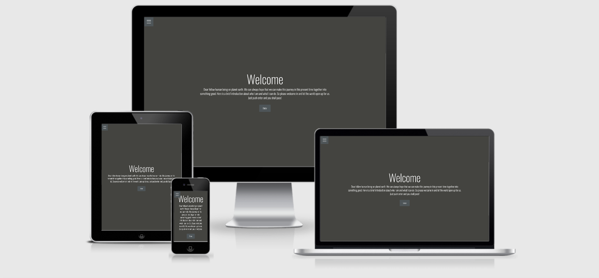

# **Personal Website - rickardzetterman.com**
 

       This is my digital shopping window for recruiters and stalkers :-)
       Where users can find information and be able to contact me if they have any question or want to collaborate.
       This makes the phase of contacting me easy for the user or recruiter or who it would be.
      
       Here is the [website](https://dddcddd.github.io/rickardzetterman/index.html) on github!
 
## **UX**
 
#### *USER STORIES
 
*   As a recruiter
   I want to find information about him
   So I can compare with other ppl
 
*   As a recruiter
   I want to find work experience and skills
   So I can compare with other ppl    
 
*   As a recruiter
   I want to find contact details
   So I can contact the person if i want to
 
*   As a recruiter
   I want see the personal information
   So I can get a clear picture about the person
 
*   As a recruiter
   I want see the actual work
   So I can get a clear picture about the person     
 
 
#### *DESIGN
   I have tried to have a clean and minimalistisk design through the website.
   I also tried to have a match CV but I need to make that over again.
##### *Colors
           Background color - #444440
           Footer and buttons - #4e5558
           Text and Icons - #ffffff
##### *Fonts  
           I used Oswald all through the website, I think it's clean.
#### **Wireframe Mockups**
I have been using Figma to do mockups
* [Figma Desktop](https://www.figma.com/file/KxUG7SCFcFrPGcvxDUw5ch/rickardzetterman.com?node-id=0%3A1)
* [Figma Mobile](https://www.figma.com/file/x0T8XoiwXqSrOWT2EDLsx9/Untitled)
 
## **Features**
 
### **Existing Features**
 
#### Index/Intro
Here I only have the hamburger navbar and son welcome text and a button who directs to the about page.
 
#### About
At the side I only have text about me and a picture of me in a circle.
 
#### CV and Skills
At this page I started with some intro text and after that I added a button that downloaded my CV.
After that three different columns of skill set comes; Development, Economics and other stuff.
 
#### Portfolio
Here I have a Bootstrap card to show off my websites that I have made. After that comes images that I made and you can push the image to make it bigger.
After that it comes with a flyer of some event I have organized and a sample video of one of our events.
 
#### Contact
Here is a contact form that still does not work.
 
#### Footer
ICONS - Linked in profile, Download CV and Mail.
Under it, its my name and a copyright text and this year 2020
 
### **Features to Implement in the future**
* Make sure the Email form works probably.
* Get the site better responsive.
* Update current skill circles and more websites to add.
* Maybe add another youtube video of me, don't know if it's too personal.
 
## **Technologies used**
* [HTML5](https://en.wikipedia.org/wiki/HTML5) - the structure on my website.
* [CSS3](https://en.wikipedia.org/wiki/Cascading_Style_Sheets#CSS_3) - Styling on my website.
* [SVG](https://www.w3schools.com/html/html5_svg.asp) - Skills circle on my site.
* [Bootsstrap](https://en.wikipedia.org/wiki/Bootstrap_(front-end_framework)) - The framework and easy implanting stuff on the site
* [Figma](https://en.wikipedia.org/wiki/Figma_(software)) - Mockups and wireframes
* [GoogleDrive](https://sv.wikipedia.org/wiki/Google_Drive) - store and write content and other information in it.
* [Github](https://sv.wikipedia.org/wiki/Github) - Provides the service and community to store websites.
* [Gitpod](https://www.gitpod.io/) - The terminal I use for this project.
* [Fontawesome](https://en.wikipedia.org/wiki/Font_Awesome) - Provides icon to my website
* [GoogleFonts](https://en.wikipedia.org/wiki/Google_Fonts) - Provides Font to my site.
* [Canva](https://en.wikipedia.org/wiki/Canva) - Canva has templates on the CV that I used.
 
## **Testing**
 
The test can been watch [here](https://github.com/dddCddd/rickardzetterman/blob/master/Testing.md)
 
 
## **Deployment**

This project was deployed to GitHub pages as follows:

1. Login to GitHub and open the repository
2. Click on Settings
3. Scroll down to the GitHub Pages
4. Below Source, change the drop-down selection from None to Master Branch
5. The automatically refreshes and the site is now deployed

I used only one branch for this project.

##### To Make a Clone:

1. Click on 'Code' in the GitHub repository menu and copy the given URL
2. In your command prompt type 'cd' followed by the director you wish to store your repository in and press enter
3. In your command prompt type 'git clone' followed by the URL copied in step 1

### **Running the project locally**
This project was written and developed using GitPod and pushed to GitHub by using GitPod's command line functions.
 
How to deploy [this](https://github.com/dddCddd/rickardzetterman) page from using GitHub Pages:
 
1. Log into GitHub.
2. From the list of repositories on the screen, choose rickard zetterman.
3. From the menu items near the top of the page, select Settings.
4. Scroll down to the GitHub Pages section.
5. Under Source click the drop-down menu labelled None and select Master Branch
6. On selecting Master Branch the page is automatically refreshed, the website is now deployed.
7. Scroll back down to the GitHub Pages section to retrieve the link to the deployed website.
 
### To clone this project from GitHub:
 
You can paste the repository link directly into any editor you use with the command 'git clone'. For example:
 
git clone it [here](https://github.com/dddCddd/rickardzetterman.git)
 
To remove the GitHub repository type 'git remote rm origin' into the terminal.
 
click [here](https://docs.github.com/en/github/creating-cloning-and-archiving-repositories/cloning-a-repository) to read more on troubleshooting and cloning GitHub repositories.
 
## **Credits**
 
### **Content**
* I wrote all content and for image an youtube video look under Media
 
### **Code**
* [Hamburger menu](https://www.youtube.com/watch?v=DZg6UfS5zYg)
* [Skill circels](https://www.youtube.com/watch?v=t7eHSAXW718)
* [Youtube video](https://www.youtube.com/watch?v=9YffrCViTVk)
* Contact form comes from a lecture at [Code Institute](https://codeinstitute.net/).
* Card for showing my website. I used [Bootsstrap](https://getbootstrap.com/) template. I also used rows from Bootstrap and a few other things.
 
### **Media**
* Youtube video are made by [Pocketbeat](https://www.pocketbeat.com/) at [Stockholm Hippie Markets](http://2019.stockholmhippiemarket.se/) gig.
* CV templates comes from [Canva](https://www.canva.com/)
* Image of my friends comes from there photograph and a picture from a free to use [website](https://pixabay.com/)
* Stockholm Hippie Market and Eldanse logos are made by Ylva Ek [linkedin](https://www.linkedin.com/in/ylvaviolaek/)
* SPDIF flyers are made by Mikael Eisen at his [linkedin](https://www.bakkeriet.com/)
* Evigheten logo i think are made by Jonas Karlsson a member at UBV. [linkedin](https://www.linkedin.com/in/jonas-karlsson-9b0a5852/)
 
### **Acknowledgements**
Precious Ijege and Xavier from [Code Institute](https://codeinstitute.net/) Special to Precious who are my mentor and giving me good feedback and helped me on my work.
Xavier for helping me with the skills circles that I had issues with figuring out how to proceed.
My friends Jonas Karlsson and Martin Gustavsson for their support and help and I'm alway welcome there to ask questions about coding.
Also all tutorials are made of people so I learn to code and create this website. Special thanks to Dante from my class at the code institute that corrects the grammar and spelling.

