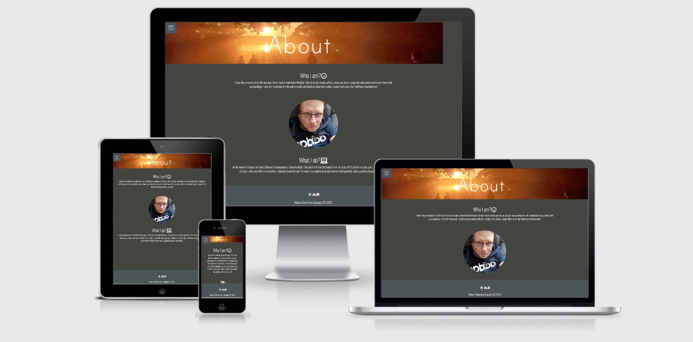
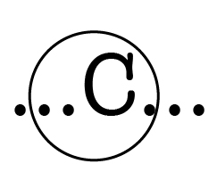
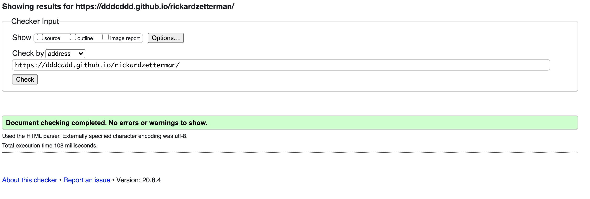
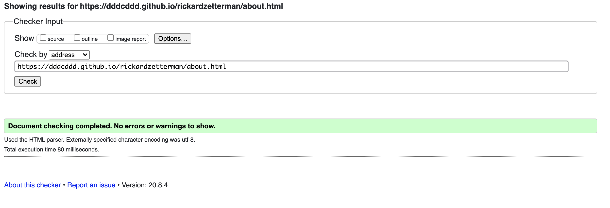
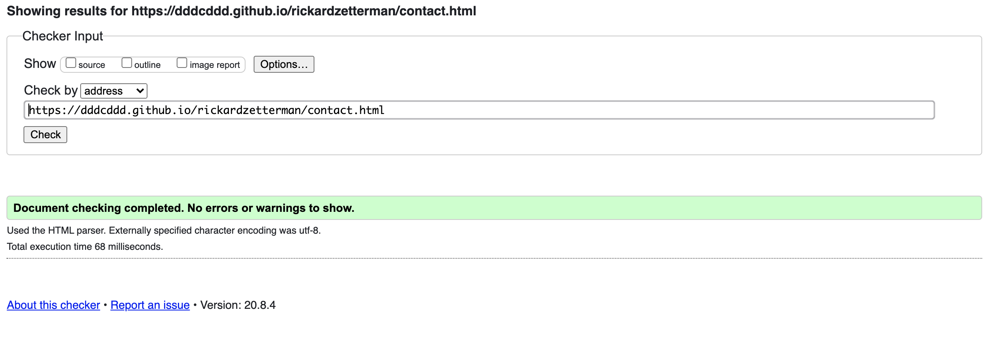
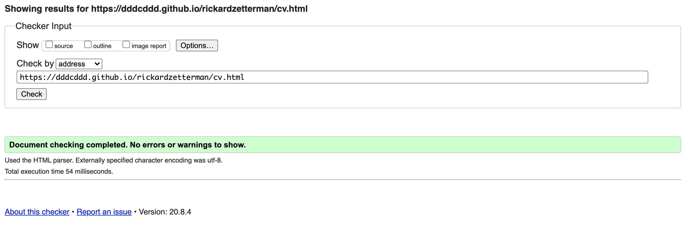
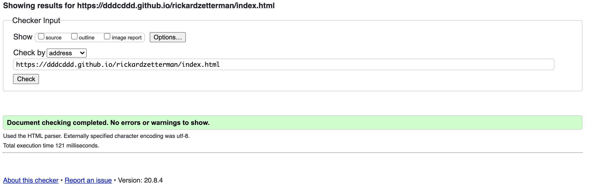
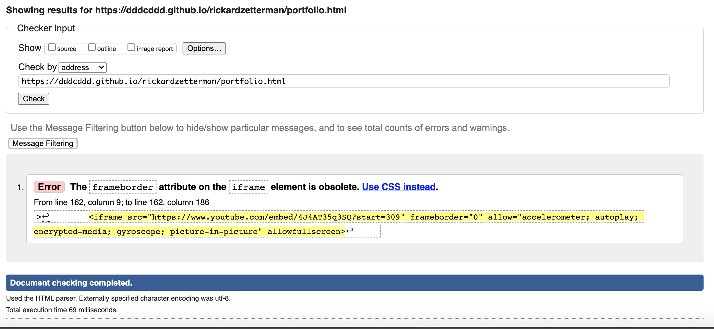
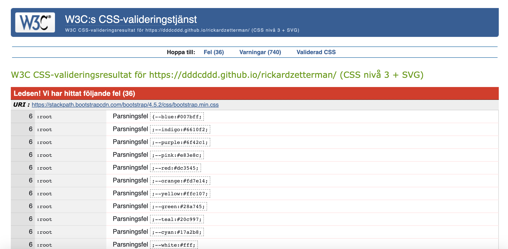

# **Personal Website - rickardzetterman.com**

        This is my digital shopping window for recruter and stalkers :-) 
        https://dddcddd.github.io/rickardzetterman/

## **UX**

#### *USER STORYS

*   As a recruter 
    I want to find information about work experience and skills 
    So I can compare with other ppl 

*   As a recruter 
    I want to find contact details 
    So I can contact the person if i want to

*   As a recruter 
    I want see the actual work and personal information about a person
    So I can get a clear picture about the person

#### *DESIGNE 
    I have tried to have a clean and minimalistisk designe throu the website. 
    I also tried to have a match CV but I need to make that over agin.
##### *Colors 
            Background color - #444440
            Footer and buttons - #4e5558
            Text and Icons - #ffffff
##### *Fonts   
            I used Oswald all throu the website, I think it's clean.

#### **Wireframe Mockups**
* Figma Desktop - https://www.figma.com/file/KxUG7SCFcFrPGcvxDUw5ch/rickardzetterman.com?node-id=0%3A1
* Figma Mobile - https://www.figma.com/file/x0T8XoiwXqSrOWT2EDLsx9/Untitled

## **Features**

#### Index/Intro 
Here I only have the hamburger navbar and som welcome text and a button who directs to the about page.

#### About 
At the side I only have text about me and a picture of me in a circle. 

#### CV and Skills 
At this page I started with some intro text and after that I added a button that download my CV.
After that three diffret columns of skillset comes; Development, Economics and other stuff.

#### Portfolio
Here I have a Bootsstrap cards to show of my websites that I have made. After that comes images that I made and you can push the image to make it bigger.
After that it comes flyer of som event I have orginized and a sample video of one of our event.

#### Contact 
Here are a contact form that still not works.

#### Footer 
ICONS - Linked in profile, Download CV and Mail. 
Under it, its my name and a copyright text and this year 2020

### **Existing Features**
* I got youtube video. 
* Hamburger bar that moves.
* Skillset rounded.

### **Features to Implement in the future**
* Make sure the Email form works propably. 
* Get the site better responsive. 
* Update current skillcircles and more websites to add.
* Maby add another youtube video of me, dont know if its to personal.

## **Technologies used**
* HTML5  - https://en.wikipedia.org/wiki/HTML5
* CSS3  - https://en.wikipedia.org/wiki/Cascading_Style_Sheets#CSS_3
* SVG  - https://www.w3schools.com/html/html5_svg.asp
* Bootsstrap - https://en.wikipedia.org/wiki/Bootstrap_(front-end_framework)
* Figma - https://en.wikipedia.org/wiki/Figma_(software)
* Google Drive - https://sv.wikipedia.org/wiki/Google_Drive
* Github - https://sv.wikipedia.org/wiki/Github
* Gitpod - https://www.gitpod.io/
* Fontawesome - https://en.wikipedia.org/wiki/Font_Awesome
* Google Fonts - https://en.wikipedia.org/wiki/Google_Fonts
* Canva - https://en.wikipedia.org/wiki/Canva

## **Testing**

* HTML Validator - https://validator.w3.org/nu/?useragent=Validator.nu%2FLV+http%3A%2F%2Fvalidator.w3.org%2Fservices&acceptlanguage=&doc=https%3A%2F%2Fdddcddd.github.io%2Frickardzetterman%2F
                    https://validator.w3.org/nu/?doc=https%3A%2F%2Fdddcddd.github.io%2Frickardzetterman%2Findex.html
                    https://validator.w3.org/nu/?doc=https%3A%2F%2Fdddcddd.github.io%2Frickardzetterman%2Fabout.html
                    https://validator.w3.org/nu/?doc=https%3A%2F%2Fdddcddd.github.io%2Frickardzetterman%2Fcv.html
                    https://validator.w3.org/nu/?doc=https%3A%2F%2Fdddcddd.github.io%2Frickardzetterman%2Fportfolio.html
                    https://validator.w3.org/nu/?doc=https%3A%2F%2Fdddcddd.github.io%2Frickardzetterman%2Fcontact.html

    
    
    
    
    
    

* CSS Validator - https://jigsaw.w3.org/css-validator/validator?uri=https%3A%2F%2Fdddcddd.github.io%2Frickardzetterman%2F&profile=css3svg&usermedium=all&warning=1&vextwarning=&lang=sv
                   
* I don't think this JIGSAW validation are correct, look at the link below!
https://stackoverflow.com/questions/52930543/8-digit-hex-is-not-a-background-color-value/52931314#52931314

## **Deployment**

### **Running the project locally**

## **Credits**

### **Content**
* I wrote all content and for image an youtube video look under Media 

### **Code**
* Hamburger menu - https://www.youtube.com/watch?v=DZg6UfS5zYg
* Skill circels - https://www.youtube.com/watch?v=t7eHSAXW718
* Contact form comes from a lecture at Code Institute.
* Card for showning my website. I used Bootsstrap template. I also used rows from Boostrap and a few other things. 

### **Media**
* Youtube video are made by Pocketbeat at Stockholm Hipie Markets gig.
* CV templates comes from Canva.
* Image of my friends comes from there photograf and a picture from https://pixabay.com/
* Stockholm Hippie Market and Eldanse logos are made by Ylva Ek
* SPDIF flyers are made by Mikael Eisen at https://www.bakkeriet.com/
* Evigheten logo i think are made by Jonas Karlsson a member at UBV. 

### **Acknowledgements**

