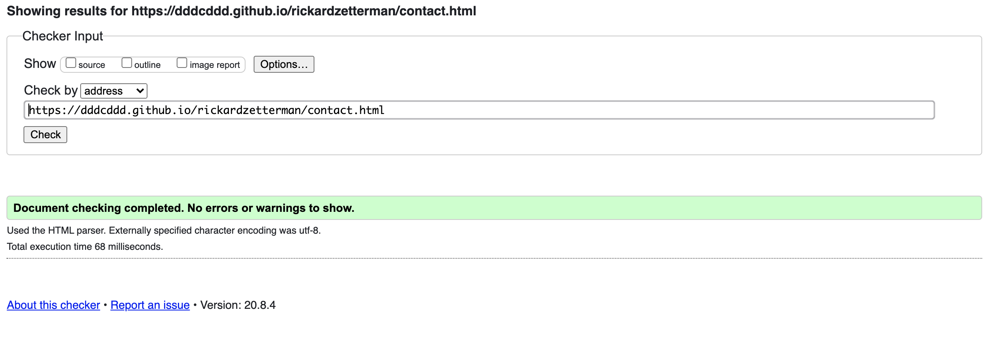
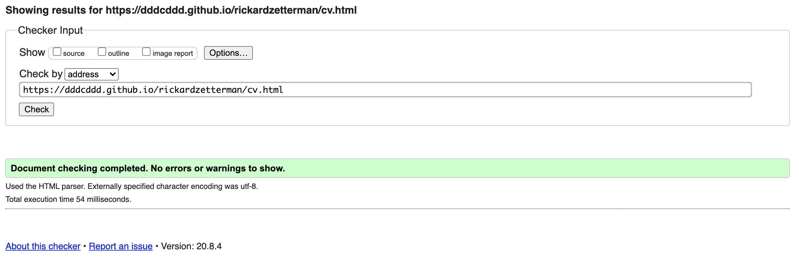
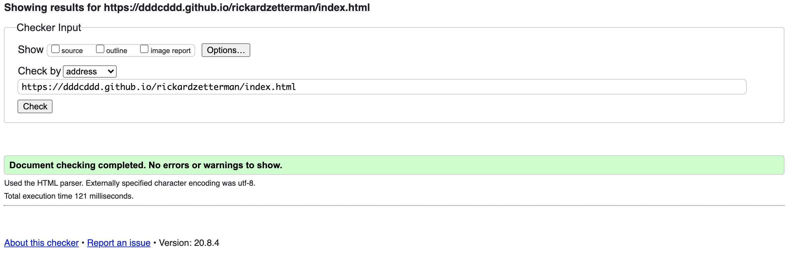
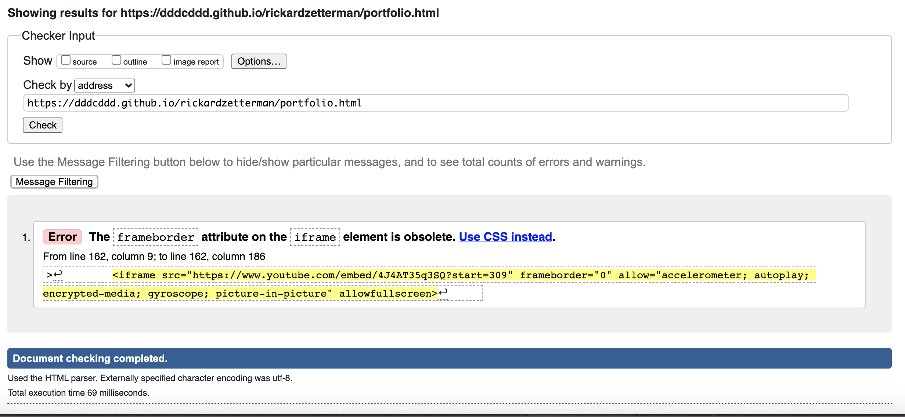
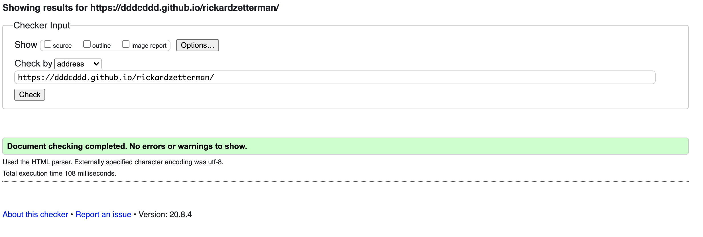
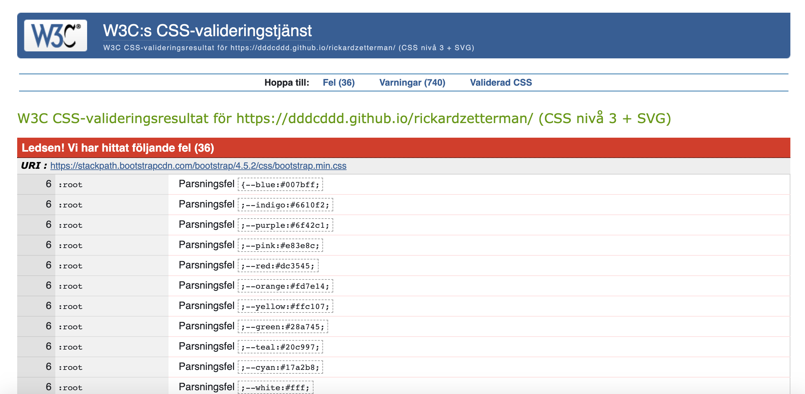
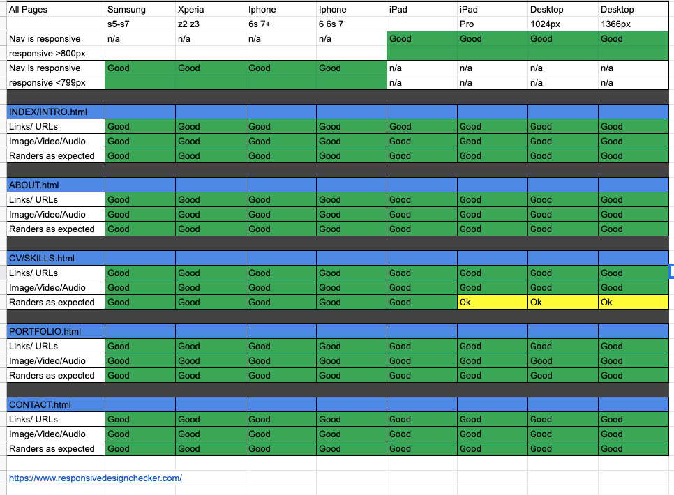
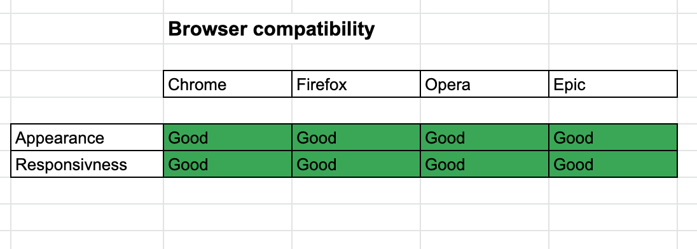

# **Testing this Website**

[HTML-Validatior](https://validator.w3.org/)
        
        
         
        
        
        

[CSS-Validiator](https://jigsaw.w3.org/css-validator/)     
        
* Many fails can on Jigsaw? I google that and can be explained [here](https://stackoverflow.com/questions/57661659/w3c-css-validation-parse-error-on-variables) 
* Also [here](https://stackoverflow.com/questions/52930543/8-digit-hex-is-not-a-background-color-value/52931314#52931314) The Jigsaw W3C CSS validator isn't known for being up to date with developing standards, such as most level 4 CSS features. New features are being introduced and implemented faster than they can be standardized or validators can catch up, so validation has become increasingly unreliable as anything other than a sanity check for potential careless mistakes, rather than traditional standards-compliance "certification" (if you will).
As long as you use the notation with the understanding that browser support isn't complete and these drafts are subject to change (although support for this notation is extremely unlikely to change), you'll be fine.
If you are concerned about validation, your best bet is to rewrite these values to their rgba() counterparts, which enjoy cross-browser support and are recognized by Jigsaw.

## Test responsivness on Devices
[Responsive-checker](https://www.responsivedesignchecker.com/)

## Test on diffrent browsers 

## Test User Stories

*   As a recruter 
    I want to find information about him 
    So I can compare with other ppl 

    * I took that youtube video away, but there are som personal information about me in about section and can figure out in portfolio.

*   As a recruter 
    I want to find work experience and skills 
    So I can compare with other ppl    

    * In the portfolio you can see some of the website I have done, also some other experince. 
    * I added my linkedin profile and CV for more information. 
    * Also the website that you are on shows some skills. 

*   As a recruter 
    I want to find contact details 
    So I can contact the person if i want to

    * You find the contact information under contact.
    * Also my linkedin are shown and can contact me throu there.
    * In my CV are my contact information

*   As a recruter 
    I want see the personal information 
    So I can get a clear picture about the person

    * Under the about section there are some info about me and also that it shows that I have organized parties.
    * I'm thinking of adding a youtube video about me.

*   As a recruter 
    I want see the actual work
    So I can get a clear picture about the person  

    * You can see the websites that I have done and the one you are at.
    * Other stuff under portfolio     
    

## Bugs

